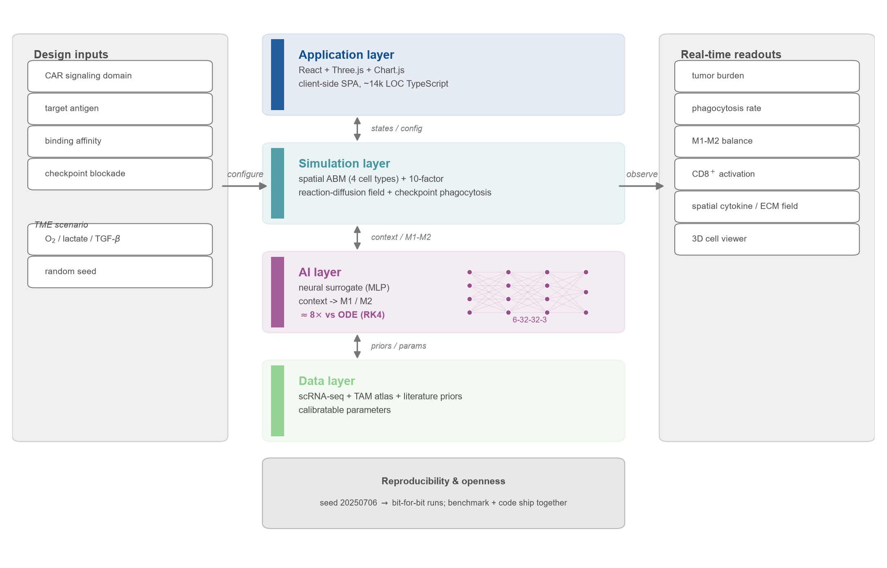
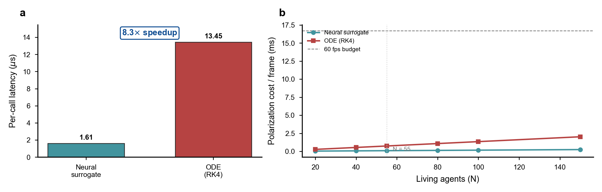
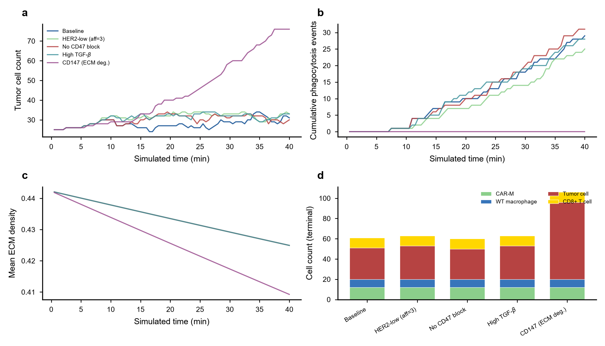
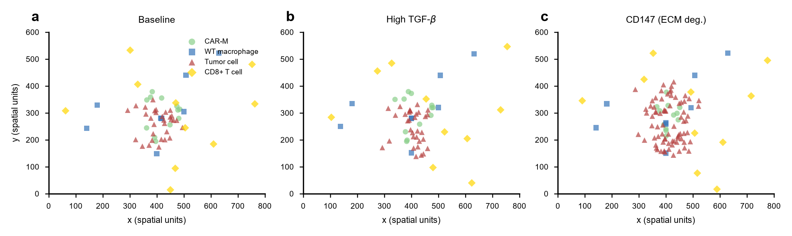
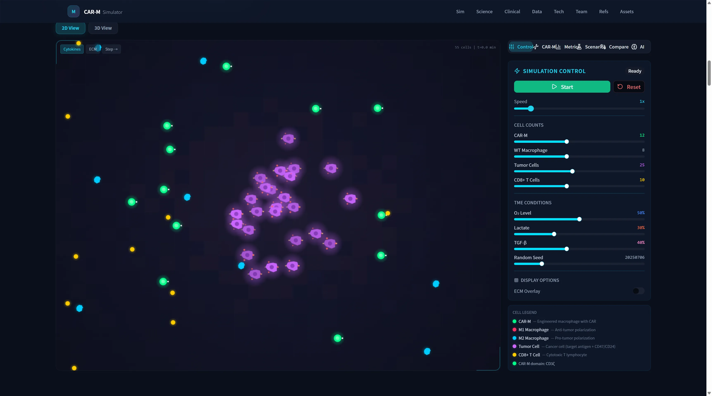

# CAR-M Simulator: A Mechanism-Inspired, Real-Time Agent-Based Platform for Exploring CAR-Engineered Macrophage Behavior in the Tumor Microenvironment

**Authors:** [Author Name(s)]¹
**Affiliation:** ¹[Institution] · Cambridge Visiting Research Program
**Correspondence:** [email]

---

## Abstract

Chimeric antigen receptor (CAR) T-cell therapy has transformed the treatment of hematological malignancies, yet its translation to solid tumors remains limited by poor infiltration, antigen heterogeneity, an immunosuppressive tumor microenvironment (TME), and toxicity. CAR-engineered macrophages (CAR-M) are an emerging alternative: macrophages natively infiltrate solid tissue and combine phagocytosis, antigen presentation, and microenvironmental remodeling. However, the design space of CAR-M constructs — signaling domain, target antigen, affinity, and checkpoint-blockade strategy — is large, and its interaction with TME conditions is difficult to reason about intuitively. We present **CAR-M Simulator**, a mechanism-inspired, browser-based platform that couples an agent-based model (ABM) of the TME, a reaction–diffusion field of ten soluble and structural factors, and a neural surrogate for macrophage polarization into an interactive, real-time simulation. The surrogate — a compact 6→32→32→3 multilayer perceptron trained on 30,000 synthetic samples from a biologically-motivated ordinary differential equation (ODE) model — replaces per-cell ODE integration and delivers an ~8× per-decision speedup in our benchmarks (1.5 µs vs. 12 µs per cell), leaving ample per-frame budget so the workbench remains interactive. We describe the platform architecture, the mechanistic models, and the engineering choices that make real-time, per-agent decision-making feasible in a web browser. We position the tool explicitly as a hypothesis-generation instrument and a candidate educational tool for *mechanistic trend exploration* — not clinical prediction — and outline a concrete path toward data-driven parameter calibration. The platform is open, reproducible, and runs entirely client-side.

**Keywords:** CAR-macrophage, agent-based modeling, tumor microenvironment, neural surrogate, scientific visualization, in-browser simulation

---

## 1. Introduction

### 1.1 Motivation

Adoptive cell therapy with CAR-T cells achieves remarkable responses in B-cell malignancies, but solid tumors present a fundamentally harder problem. Effector cells struggle to penetrate the tumor stroma, are actively suppressed once inside, face heterogeneous and shifting antigen expression, and can provoke dangerous systemic toxicity [1,2]. CAR-engineered macrophages (CAR-M) have attracted growing attention precisely because macrophages address several of these barriers at once: they are naturally motile within solid tissue, they can be redirected to phagocytose antigen-positive tumor cells, and they participate in antigen presentation and TME remodeling [3,4]. The first-in-human trial of a HER2-directed CAR-M (CT-0508) reported an encouraging early safety profile, motivating broader interest in the modality [5].

Designing a CAR-M construct, however, means navigating a combinatorial space. The intracellular signaling domain (e.g., CD3ζ, FcRγ, CD147, MerTK) shapes the effector program; the target antigen (HER2, CD19, EGFR) and binding affinity set the recognition threshold; and checkpoint-blockade choices (CD47/SIRPα, CD24/Siglec-10 — the "don't-eat-me" axes) gate phagocytic execution [6,7]. These design levers do not act in isolation: their effect depends on TME conditions such as hypoxia, lactate accumulation, TGF-β load, and extracellular-matrix (ECM) density. Reasoning about the *joint* behavior of construct and context is exactly where intuition fails and where a computational sandbox can help.

### 1.2 Approach and contributions

We built CAR-M Simulator to make this joint behavior tangible. The platform lets a user configure a CAR-M construct and TME scenario, run a spatial agent-based simulation of the resulting cell population, and watch mechanistic readouts (tumor burden, phagocytosis rate, M1/M2 balance, CD8⁺ T-cell activation) evolve in real time. Our contributions are:

1. **An integrated, real-time TME model in the browser.** We combine a spatial ABM of four cell types with a ten-factor reaction–diffusion field and a checkpoint-aware phagocytosis model, running entirely client-side with no server dependency.

2. **A neural surrogate for the polarization bottleneck.** We replace the per-cell polarization ODE with a small MLP, and we quantify — with a reproducible benchmark — the speedup it provides and the interactivity headroom it buys.

3. **An honest, mechanism-inspired framing.** We are explicit that the platform explores *mechanistic trends* under stated assumptions and is intended for hypothesis generation, teaching, and experimental prioritization — not clinical prediction. We describe how parameters would be calibrated against data.

4. **A reproducible, open engineering artifact.** The simulation is deterministic under a fixed seed, the asset-generation pipeline is scripted, and the benchmark used for our performance claims ships with the code.

### 1.3 Scope and non-goals

We state the boundary up front because it governs every design decision that follows. CAR-M Simulator is a *mechanism-inspired* model. Its parameters are drawn partly from the literature and single-cell atlases and partly from plausibility-based assumptions; several relationships are deliberately simplified to remain real-time and interpretable. The tool is therefore appropriate for asking "which direction does this design push the system?" and inappropriate for asking "will this construct succeed in a patient?" Any quantitative readout should be read as a relative, directional comparison between configurations, not an absolute prediction.

---

## 2. Related Work

**Agent-based models of tumor–immune interaction.** ABMs have a long history in tumor immunology, from lattice models of tumor growth to off-lattice hybrid models coupling discrete cells with continuous chemical fields [8,9]. Frameworks such as PhysiCell provide powerful, high-fidelity multicellular simulation but target offline, high-performance computing rather than interactive, in-browser exploration [9]. Our design deliberately trades some fidelity for interactivity and accessibility.

**Data-driven single-cell modeling.** Single-cell RNA sequencing and tumor-associated-macrophage (TAM) atlases have made macrophage state landscapes far more legible, and deep generative models such as scVI provide principled low-dimensional representations of that landscape [10,11]. We borrow the *spirit* of these approaches — learned, compact representations of high-dimensional biology — in our surrogate, while acknowledging that our current model is trained on synthetic ODE-derived data rather than measured single-cell profiles.

**Surrogate modeling for simulation acceleration.** Replacing expensive numerical solvers with learned surrogates is now standard practice in scientific computing [12]. Our use is narrow but effective: the polarization step is the per-agent hot path, and a small MLP approximates its steady-state map at a fraction of the cost.

**Adjacent interactive and multiscale tooling.** A rich ecosystem of multiscale ABM frameworks — including CompuCell3D [13], Morpheus [14], and PhysiBoSS [15] — and a growing body of CAR-T/CAR-M and macrophage-polarization models occupy the space adjacent to this work, generally prioritising spatial and biochemical fidelity in offline, high-performance settings. Separately, the browser has become a credible runtime for scientific *visualisation* (e.g. WebGL-based molecular viewers [16]), but real-time, seeded-reproducible, client-side *simulation* of a checkpoint-aware TME remains uncommon. We position CAR-M Simulator as complementary to, rather than a replacement for, the higher-fidelity offline tools: our contribution is the deliberate interactivity–fidelity trade-off (Section 7) that lets a construct–and–context hypothesis be configured, run, and compared in a browser, with the surrogate removing the per-agent polarization bottleneck that would otherwise preclude real-time per-frame decisions. A panel-by-panel delineation against each adjacent framework is deferred to a journal-targeted revision.

---

## 3. System Architecture

CAR-M Simulator is organized as four conceptual layers (Figure 1).

- **Data layer.** Biological priors — cytokine roles, polarization drivers, checkpoint biology — informed by literature and single-cell/TAM atlases. This layer supplies the *structure* of the models (which factors matter and in which direction), while their numerical parameters are treated as calibratable.

- **AI layer.** A neural surrogate that maps local cytokine and metabolic context to macrophage polarization state, replacing per-cell ODE integration (Section 4.4).

- **Simulation layer.** The agent-based engine, the reaction–diffusion field, the checkpoint-aware phagocytosis model, and the chemotaxis rules that together produce emergent population behavior (Sections 4.1–4.3).

- **Application layer.** A React + TypeScript single-page application with a Three.js 3D asset viewer and Chart.js dashboards, delivering the interactive workbench in which users design constructs, run scenarios, and compare outcomes.

The implementation is ~14,000 lines of TypeScript across ~93 files, built with Vite. The entire simulation runs on the client; there is no backend inference service.



**Figure 1 | System architecture of CAR-M Simulator.** The platform is organized as four conceptual layers connected by bidirectional data flow, framed by the design inputs the user supplies (left) and the real-time readouts the workbench returns (right). The data layer encodes biological priors (cytokine roles, polarization drivers, checkpoint biology) drawn from the literature and single-cell/TAM atlases as calibratable structure. The AI layer provides a neural surrogate (a 6→32→32→3 multilayer perceptron, sketched inside the layer) that maps local cytokine and metabolic context to macrophage polarization state, replacing per-cell ODE integration (Section 4.4); the ~8× speedup versus the ODE is what makes per-frame, per-agent decisions tractable. The simulation layer couples a spatial agent-based model of four cell types with a ten-factor reaction–diffusion field and a checkpoint-aware phagocytosis module (Sections 4.1–4.3). The application layer is a client-side React + Three.js + Chart.js single-page application (~14,000 lines of TypeScript) with no backend dependency. The right-hand column lists the six readouts the workbench exposes live; under the default immunosuppressive seed used for the deterministic runs in Figures 3–4, the M1/M2-balance and CD8⁺-activation traces remain near baseline and are therefore reported as terminal/summary values rather than as separate time-series panels (Section 5.2). Vector source (SVG/PDF) ships with the repository.

---

## 4. Methods

### 4.1 Agent-based engine

The core is a continuous-space, discrete-time agent-based model. Four agent types populate a 2D domain representing a tissue cross-section: CAR-macrophages, wild-type macrophages, tumor cells, and CD8⁺ T-cells.

**Main loop.** Each frame advances the system by a bounded time step. The wall-clock delta is clamped to prevent instability, `dt = min(Δt_ms / 1000, 0.05) × speed`, where `speed` is a user-controlled multiplier; manual single-stepping uses a fixed `dt = 0.1 × speed`. The loop then, in order: (1) updates the diffusion field; (2) rebuilds the spatial index; (3) lets every living agent sense its local environment and act; (4) resolves CD8⁺ clonal expansion; (5) resolves tumor proliferation; (6) removes dead agents; and (7) samples statistics.

**Spatial indexing.** To avoid O(n²) neighbor queries, agents are hashed into a uniform grid with cell size 50 (spatial units). A neighbor query for radius *r* around a point visits only the grid buckets overlapping the axis-aligned box of half-width *r*, giving near-constant-time local lookups for the cell densities used here.

**Determinism.** All stochastic decisions draw from a seeded linear congruential generator, `x ← (1664525·x + 1013904223) mod 2³²`, returning `x / 2³²`. A fixed default seed (20250706) makes any run bit-for-bit reproducible, which is essential for honest A/B comparison of designs. The LCG is chosen for simplicity and reproducibility rather than statistical quality; consequently, spatial patterns in any single-seed snapshot (Figure 4) reflect the engine's stochastic stream and should not be interpreted statistically without inter-seed averaging (Section 7).

**Numerical and implementation caveats.** Two notes govern the engine's use as an interactive tool. First, the reaction–diffusion field is integrated with an explicit scheme whose stability bound (Section 4.3) can be exceeded at high user `speed`; the presented figures use the default speed and are unaffected, but field sub-stepping or a documented speed cap is planned so that fast-forwarded interactive runs cannot silently diverge (Section 7). Second, the 0.05 s wall-clock cap prevents divergence when the browser tab is throttled, at the cost of time-dilation relative to wall-clock time; all readouts are governed by the simulation clock, not the wall clock. The engine retains the most recent 200 sampled points for plotting (a memory bound); for runs longer than ~100 simulated minutes the left edge of the chart window is therefore truncated, which users of long scenarios should note.

**Statistics.** The engine samples aggregate readouts every 0.5 simulated minutes and retains the most recent 200 points for plotting, bounding memory and keeping charts responsive during long runs.

### 4.2 Cell agents and behavior

Each agent carries a position, velocity, radius, and type-specific internal state. Baseline configuration is summarized in Table 1.

**Table 1. Agent configuration.**

| Agent type | Radius | Base speed | Initial count |
|---|---|---|---|
| CAR-macrophage | 10 | 0.8 | 12 |
| Wild-type macrophage | 9 | 0.5 | 8 |
| Tumor cell | 14 | 0.1 | 25 |
| CD8⁺ T-cell | 6 | 1.2 | 10 |

**Motility and chemotaxis.** Agents combine a persistent random walk (a Brownian force scaled to `0.3 × speed`, with velocity damping of 0.95) with directed chemotaxis. Macrophage chemotaxis reads local cytokine gradients by central differences and biases movement by polarization state: the effective gradient is `grad(IFN-γ)·m1Score + grad(TGF-β)·m2Score`, so M1-leaning cells move up pro-inflammatory gradients while M2-leaning cells follow immunosuppressive cues. CD8⁺ T-cells additionally follow the CXCL9 gradient with a step scaled by their activation level. Movement in all cases is slowed by local ECM density (a factor of `1 − 0.7 · ecmDensity`), modeling the stromal barrier.

**Checkpoint-aware phagocytosis.** The central mechanistic module is the CAR-M phagocytosis decision. For a candidate tumor target, the engine computes a base probability from receptor engagement and then modulates it by the two "don't-eat-me" checkpoint axes, the effector program, and metabolic state:

```
p_base    = (affinity / 10) × antigenDensity
cd47      = 1 − CD47_expr × (CD47 blocked ? 0.15 : 0.85)
cd24      = 1 − CD24_expr × (CD24 blocked ? 0.20 : 0.55)
m1Bonus   = CD3ζ: 1 + 0.5·m1Score | FcRγ: 1 + 0.3·m1Score | MerTK: 1
energy    = clamp(energy / 50, 0.3, 1)
p_final   = clamp(p_base × cd47 × cd24 × m1Bonus × energy, 0, 1)
```

Here `antigenDensity` is read from the target's HER2/CD19/EGFR expression according to the configured `targetAntigen`. The signaling domain changes behavior qualitatively, not just quantitatively: **CD3ζ** and **FcRγ** give standard phagocytosis with an M1-dependent bonus; **CD147** does not phagocytose at all but instead secretes matrix metalloproteinase, degrading local ECM (`−0.01 · dt` per step) to model stromal remodeling; and **MerTK** performs efferocytosis, engaging only low-viability targets (viability < 0.4) but with doubled probability. Successful phagocytosis costs 30 energy units and occupies the cell for a domain-dependent duration (≈2–4 s). The energy normalisation (÷50) and the 0.3 floor are modelling choices without a direct biological calibration; they are part of the plausibility-based parameter set noted in Section 7. Wild-type macrophages share the same phagocytosis routine but with no CAR engagement (the affinity term set to zero), so their probability reduces to a weak, M1-gated residual that provides an internal control arm; the exact residual constants are defined alongside the CAR-M module in the source and belong to the same plausibility-based parameter set.

**Polarization dynamics.** Rather than integrating a polarization ODE per cell per frame, each macrophage queries the neural surrogate (Section 4.4) with its local cytokine and metabolic context to obtain target M1/M2 scores, then relaxes toward them exponentially: `m1Score += (nnM1 − m1Score) · τ · dt · 10` with `τ = 0.15` (and symmetrically for M2). The resulting relaxation time-constant, 1/(τ·10) ≈ 0.67 simulated minutes, is a modelling choice tuned for numerical stability rather than fitted to the ODE's transient; τ is included in the planned sensitivity analysis (Section 7). Discrete phenotype is assigned by thresholding (M1 if m1Score > 0.6, M2 if m2Score > 0.6, otherwise MIXED). CAR-M cells start balanced (m1 = m2 = 0.5); wild-type macrophages start M2-skewed (m1 = 0.2, m2 = 0.8), reflecting the default TAM state.

**CD8⁺ T-cell effector logic.** Activated, non-anergic CD8⁺ cells kill on contact with probability `0.08 · activationLevel · (1 − 0.8·exhaustion)`; three or more kills trigger delayed clonal expansion, capped at three times the initial CD8⁺ count (≤ 30 cells for the default configuration). Exhaustion accumulates under immunosuppression and is relieved by IFN-γ: `d(exhaustion) = (0.05·TGF-β + 0.03·IL-10 − 0.02·IFN-γ) · dt`, coupling adaptive immunity to the macrophage-shaped cytokine milieu.

### 4.3 Reaction–diffusion field

Ten factors are simulated on a uniform grid with spacing 40 units: **oxygen, lactate, TGF-β, IFN-γ, IL-4, IL-10, VEGF, CXCL9, SPP1, and ECM density**. These span metabolic state (O₂, lactate), immunosuppression (TGF-β, IL-10, SPP1), pro-inflammatory signaling (IFN-γ, CXCL9), M2 induction (IL-4), angiogenesis (VEGF), and the structural stromal barrier (ECM).

Each factor evolves by explicit finite-difference diffusion with a five-point Laplacian and zero-flux (Neumann) boundaries. Per step, a factor first decays and then diffuses:

```
c_new(i,j) = c(i,j) + (D·dt / h²) · [ c(i+1,j) + c(i−1,j) + c(i,j+1) + c(i,j−1) − 4·c(i,j) ]
```

with diffusion coefficient `D = 1000` for soluble factors and `D = 50` for the near-static ECM. First-order decay rates differ by factor (e.g., IFN-γ ≈ 0.04, IL-4/IL-10/CXCL9/SPP1 ≈ 0.03, lactate/VEGF ≈ 0.02 per step), while oxygen relaxes toward a baseline of 0.5. Sources and sinks are cell-driven: tumor cells consume oxygen and secrete lactate, TGF-β, and VEGF (amplified under hypoxia); M1 macrophages and activated CD8⁺ cells secrete IFN-γ and CXCL9; M2 macrophages secrete IL-10 and SPP1; and CD147 CAR-M degrade ECM. Initial fields are laid out radially to create a hypoxic, immunosuppressive tumor core surrounded by a better-oxygenated rim.

**Boundary and discretisation caveats.** Three simplifications shape the spatial readouts and are stated so they are not over-interpreted. (i) Under strictly closed (Neumann) boundaries, secreted factors leave the domain only by first-order decay, so factor mass can accumulate near the walls and the core-vs-rim cytokine structure is partly an initial-condition/secretion transient rather than a true tissue steady state; an absorbing or vascular-clearance boundary is the more physical alternative and is noted as future work (Section 7). (ii) A single diffusion coefficient is used for all nine soluble factors, collapsing their true molecular-weight- and binding-dependent differences; per-factor *D* is on the calibration roadmap. (iii) The 40-unit grid makes the field piecewise-constant at the scale of the smaller agents, so chemotaxis reads a spatially quantised gradient; bilinear interpolation at agent positions is a planned refinement. None of these affect the directional conclusions at the displayed resolution, but they bound the spatial interpretation of Figure 4.

### 4.4 Neural surrogate for polarization

**Architecture.** The surrogate is a fully-connected MLP with layer sizes **6 → 32 → 32 → 3**, ReLU activations on the two hidden layers and a sigmoid on the output. It maps a six-dimensional local context — `[IFN-γ, IL-4, IL-10, TGF-β, oxygen, lactate]`, each normalized to [0,1] — to `[M1_score, M2_score, phagocytosis_probability]`; the simulation consumes the two polarization outputs to drive the relaxation dynamics of Section 4.2, while the third (phagocytosis-probability) output is trained on the same ODE-derived labels but is not read by the engine — it is retained as a consistency output, not as a fast-path replacement for the Section 4.2 phagocytosis formula.

**Training and validation metric.** The network was trained on 30,000 synthetic samples generated by a biologically-motivated ODE polarization model, with inputs drawn uniformly over [0,1]⁶, for 100 epochs, on an 80/20 train/validation split under a fixed seed. The reported **95.96%** is per-sample discrete-label accuracy — agreement on the thresholded phenotype in {M1, M2, MIXED} derived from the ODE outputs — evaluated on the held-out 20%; we emphasise that this is a single static, single-step metric. Per-output regression error (MAE/R² on the continuous M1, M2, and phagocytosis outputs) and, more importantly, the *trajectory-level* ODE-vs-surrogate error accumulated under the exponential-relaxation scheme of Section 4.2 are not yet characterised; both are listed as planned validation (Section 7), because a high single-step accuracy does not by itself bound drift over a 40-minute run. In effect, the surrogate learns a fast, differentiable approximation of the ODE's steady-state map. We emphasise that the *ground truth* here is the ODE itself, not experimental data; calibrating both against measured single-cell profiles is future work (Section 6).

**Inference engine.** Weights are stored inline and pre-flattened into `Float32Array` buffers at load time to avoid per-call allocation. Inference is a straightforward layer-by-layer matrix–vector product with fused activation, running as scalar CPU loops (no SIMD or GPU). Because the network is tiny, this naive path is more than fast enough (Section 5).

---

## 5. Results

### 5.1 Surrogate performance

We benchmarked the exact production inference path against an equivalent RK4 ODE polarization solver over the same six-dimensional input space (200,000 randomized evaluations each, after JIT warm-up; a reproducible script ships with the code). The surrogate averaged **1.5 µs per cell-decision** versus **12 µs** for the ODE integrator — an **~8× speedup** for the polarization step. Table 2 translates this into per-frame budget for a representative scene of 55 living agents.

**Table 2. Polarization cost per frame (N = 55 agents).**

| Method | Per-call | Per-frame (N=55) | 60 fps headroom |
|---|---|---|---|
| Neural surrogate | 1.5 µs | 0.08 ms | ~200× |
| ODE (RK4) | 12 µs | 0.66 ms | ~25× |

*Headroom = 16.7 ms ÷ per-frame cost, rounded to one significant figure because the per-call latencies are single-machine point estimates (Section 7); linear extrapolation places the 60-fps polarization ceiling at roughly N ≈ 1.4×10³ (ODE) and N ≈ 1.1×10⁴ (surrogate), though the practical ceiling is lower once rendering and diffusion costs, which also scale with N, are included.*

Three honest caveats. First, our RK4 baseline relaxes to a quasi-steady state over 200 integration steps; a stiffer or higher-accuracy solver, or a larger cell population, would widen the gap substantially, whereas a coarser ODE would narrow it. The speedup is therefore a property of the solver configuration, not a universal constant. Second, earlier internal presentation material quoted an "847 ms vs. 0.3 ms" figure; that number is **not** reproducible from the source and we do not use it. The measured ~8× is the claim we stand behind. Third, the values above are point means from a single timed process; we do **not** draw biological error bars (a timing mean is not a biological replicate), but we also have not yet reported independent *timed-replicate* variance (median + IQR across processes, with the host environment logged), which is needed to quantify how the ratio transfers across machines and is listed as a planned robustness check (Section 7) — 1.5 µs is close to timer and garbage-collection resolution on the benchmark host. The practical takeaway is unchanged: with the surrogate, polarization consumes well under 1 ms per frame even at scene scale, leaving ample budget for rendering and interaction and keeping the workbench fluid.



**Figure 2 | Polarization surrogate performance.** **a**, Per-call latency of the neural surrogate versus an equivalent RK4 ODE polarization solver over the same six-dimensional input space, showing an ~8× speedup (1.5 µs versus 12 µs per cell-decision). **b**, Per-frame polarization cost as a function of the number of living agents *N*; the dashed line marks the 16.7 ms budget for 60 fps and the dotted line marks the typical scene size (*N* = 55), at which the surrogate consumes 0.08 ms per frame against 0.66 ms for the ODE. Values are single-machine deterministic micro-benchmark means over 200,000 evaluations per method after JIT warm-up (the reproducible script ships with the code); error bars are omitted because each bar is a timing mean rather than a biological replicate, and absolute latencies vary by hardware (independent timed-replicate variance is planned; Section 7). Source data are provided as a Source Data file.

### 5.2 Qualitative mechanistic behavior

Under a fixed seed, the platform produces reproducible, mechanistically plausible trajectories that respond in the expected *direction* to design and context changes. The five scripted scenarios are defined in Table 3; representative observations include:

**Table 3. Scenario design matrix.** All scenarios share the agent configuration of Table 1 and the default seed (20250706); only the columns below are varied. Affinity is on a 0–10 scale; the TGF-β column gives the initial-field level (baseline 0.4); CD47/CD24 columns denote whether the corresponding "don't-eat-me" axis is blocked in the phagocytosis module.

| Scenario | Signaling domain | Antigen | Affinity | CD47 block | CD24 block | TGF-β level | Rationale |
|---|---|---|---|---|---|---|---|
| Baseline (CT-0508-inspired) | CD3ζ | HER2 | 8 | on | off | 0.4 | HER2-directed CAR-M with the CD47 axis blocked |
| HER2-low | CD3ζ | HER2 | 3 | on | off | 0.4 | Antigen-poor context; recognition threshold harder to reach |
| No CD47 block | CD3ζ | HER2 | 8 | off | off | 0.4 | Isolates the contribution of the CD47/SIRPα gate |
| High TGF-β | CD3ζ | HER2 | 8 | on | off | 0.8 | Immunosuppressive context (2× baseline TGF-β field) |
| CD147 (ECM degradation) | CD147 | HER2 | 8 | on | off | 0.4 | Non-phagocytic domain; mechanism switch to stromal remodeling |

- **Checkpoint blockade is encoded in the phagocytosis module (encoded-and-visualised, not emergent).** The CD47/SIRPα and CD24/Siglec-10 terms implement the "don't-eat-me" gate by construction, so the workbench lets a user *inspect* how toggling blockade changes the multiplier the model applies. At the single default seed and parameterization shown in Figure 3b, however, the directional separation between blocked and unblocked runs is **not** resolved above the engine's stochastic variation — the unblocked curve does not sit consistently below baseline — so we do **not** claim a visible clearance gain here; confirming the sign of the effect requires a multi-seed Monte-Carlo envelope (planned; Section 7), which is also why we treat this as an encoded, inspectable behaviour rather than a demonstrated trend.

- **Signaling-domain choice changes the mechanism, not just the rate (emergent at the population level).** Switching to CD147 disables phagocytosis entirely and instead degrades ECM; as a consequence tumour counts are *not* held near their starting value by phagocytosis as in the other four scenarios but grow largely unchecked (Figure 3a), while ECM density falls fastest (Figure 3c) — a qualitatively different route that the workbench makes visible. Two honest qualifications: the downstream inference "lower ECM should improve motility" is a *prediction* the model can now be used to visualise (via the ECM-slowed motility term of Section 4.2), not an outcome plotted here; and because CD147's non-phagocytic mechanism leaves the most tumour cells at the terminal step (76 tumour cells of 106 total; Figure 3d), this route does not, at this parameterization, achieve tumour control — illustrating that a mechanism change is not automatically a beneficial one, which is exactly the directional insight the sandbox is for.

- **TME and antigen context shift the active readouts within their mechanism-imposed envelope (encoded-and-visualised).** Lowering antigen affinity (HER2-low) visibly weakens cumulative phagocytosis relative to baseline (Fig. 3b, lowest curve), because the recognition threshold in the phagocytosis module is harder to reach; raising TGF-β (initial field 0.4 → 0.8) has a more modest effect on these already-engaged readouts at this parameterization, and the CD8⁺-activation readout stays near its low baseline across scenarios (summarized in Fig. 3d). The observation is deliberately directional and bounded: context changes the *active* outputs the field currently moves, while readouts whose discrete gate is not crossed remain flat — which is itself the mechanism-inspired behaviour we expect (Section 1.3), not a calibrated dose–response.

- **Adaptive coupling is wired but not yet activated at this parameterization (emergent capacity).** The reaction–diffusion field connects macrophage polarization to adaptive immunity — M1-skewed macrophages secrete IFN-γ and CXCL9 that can recruit and sustain CD8⁺ T-cells, while heavy TGF-β/IL-10 loads drive CD8 exhaustion — and this macrophage→T-cell coupling is emergent from the field rather than hard-coded. Under the default, deliberately immunosuppressive seed, however, the discrete M1 classification and the CD8⁺-activation readout stay near baseline (Fig. 3d); we therefore treat this coupling as a *designed mechanistic capacity* whose directional signature would sharpen under stronger pro-inflammatory drive or after data-driven calibration, consistent with the boundary drawn in Section 1.3.

We stress that these are *directional* results appropriate for hypothesis generation and teaching. We report them as trends, not as calibrated quantitative predictions. Because each curve is a single deterministic trajectory, the *magnitude* of the visible inter-scenario gaps is confounded with the engine's own stochastic variation; we therefore read these gaps as directional hypotheses and plan inter-seed Monte-Carlo envelopes (Section 7) before treating any of them as robust.



**Figure 3 | Mechanistic trend exploration across design and context perturbations.** Five scripted scenarios (Table 3) were run with a fixed deterministic seed (20250706) and identical agent counts; only the CAR construct or TME parameter was varied. **a**, Tumor cell count over simulated time: CD147 (ECM-degradation domain) shows continuous tumor growth because this domain does not phagocytose, while the remaining four scenarios hold tumour counts near their starting value. **b**, Cumulative phagocytosis events: CD147 records zero events (consistent with its non-phagocytic mechanism), while HER2-low (affinity = 3) accumulates events more slowly than baseline, reflecting the recognition-threshold dependence of the phagocytosis module; the blocked-vs-unblocked CD47 comparison is not resolved above seed noise at this single seed (Section 5.2). **c**, Mean ECM density: CD147 degrades ECM most rapidly (the module's designed mechanism), while all other scenarios show a slower, passive decline. **d**, Terminal cell composition stacked by type; CD147's final scene contains 106 total cells of which 76 are tumour (versus 60–63 total cells with 30–33 tumour in the other scenarios), illustrating how a mechanism change — not a rate change — qualitatively reorganizes the population. Note that discrete M1/M2 classification and CD8⁺ activation remained near baseline under this parameterization (Section 5.2), which is consistent with the mechanism-inspired boundary stated in Section 1.3; we therefore report them as terminal/summary values rather than as separate time-series panels. Each curve is a single deterministic trajectory; inter-seed envelopes are planned (Section 7). Trajectories were generated by the deterministic engine and are bit-for-bit reproducible. Source data are provided as a Source Data file.



**Figure 4 | Spatial TME snapshots at simulation end.** Agent positions at the terminal time step for three representative scenarios, plotted in the 800 × 600 spatial-unit domain with cell-type-specific markers (green circles, CAR-M; blue squares, WT macrophage; red triangles, tumour cell; gold diamonds, CD8⁺ T cell). **a**, Baseline (CT-0508-inspired): a compact tumour cluster is surrounded by a mixed immune infiltrate. **b**, High TGF-β: tumour cells remain more dispersed, reflecting reduced immune pressure at this parameterization. **c**, CD147 (ECM degradation): the terminal scene holds the most tumour cells (76 tumour of 106 total), consistent with the non-phagocytic mechanism of this domain and the ECM-degradation trajectory shown in Figure 3c. Positions are deterministic outputs of a single fixed-seed engine run; spatial patterns from one seed should not be interpreted statistically without inter-seed averaging (Section 7). Source data are provided as a Source Data file.

### 5.3 Interactivity and reproducibility

The full application builds to a static bundle and runs client-side; a production build completes in ~11 s and the simulation sustains interactive frame rates on commodity laptops. Determinism under a fixed seed means any comparison shown in the interface — baseline vs. modified construct — can be reproduced exactly, which we consider a prerequisite for using the tool to reason about design differences rather than sampling noise.



**Figure 5 | The interactive workbench.** Screenshot of the client-side interface during a running simulation. The central canvas renders the spatial ABM (cell agents over the cytokine/ECM field); the tabbed panel exposes construct design (signaling domain, target antigen, affinity, CD47/CD24 checkpoint toggles), TME-scenario sliders (O₂, lactate, TGF-β, seed), the live metrics dashboard (tumor burden, phagocytosis rate, M1/M2 balance, CD8⁺ activation), preset scenarios, the A/B compare view, and the AI/surrogate panel; the cell legend and readout list summarise the available real-time quantities, including the M1/M2 and CD8⁺ traces that remain near baseline under the default seed (Section 5.2). The same deterministic seed reproduces the exact view. Captured from the production build; the workbench runs entirely client-side with no backend.

---

## 6. Discussion

### 6.1 What the platform is good for

CAR-M Simulator turns an abstract design space into something a researcher, student, or reviewer can manipulate and watch. Its value is threefold. As a **hypothesis-generation** tool, it lets a user quickly ask "which lever matters most here?" and see the direction and rough sensitivity of the response — useful for prioritizing which constructs or contexts merit costly wet-lab investigation. As a **teaching** instrument (an intended use; we have not yet conducted a formal classroom or usability evaluation), it is designed to make normally invisible couplings — checkpoint biology, polarization, cytokine cross-talk, adaptive recruitment — concrete and interactive in a way static figures cannot. As an **engineering demonstration**, it shows that a non-trivial, multi-scale mechanistic model can run in real time in a browser, lowering the barrier to sharing and reproducing computational immunology models.

### 6.2 The surrogate trade-off

The neural surrogate is the design choice that makes per-agent, per-frame decision-making tractable. Its cost is a layer of approximation: the network reproduces the ODE's discretised steady-state polarization label to ~96% per-sample accuracy on a held-out split (the precise metric and its limits are given in Section 4.4), and the simulation further approximates dynamics by exponential relaxation toward that map rather than full integration. We view this as an acceptable and, importantly, *inspectable* trade-off — the surrogate can be toggled and compared against the ODE, and its single-step error is bounded by the training distribution; per-output regression error and trajectory-level fidelity remain to be characterised (Section 7). The broader lesson is that even a tiny learned surrogate can remove a real interactivity bottleneck without a GPU.

### 6.3 Honest positioning versus clinical prediction

We have been deliberate about framing throughout, and we reiterate it because it is easy to over-claim with a polished interface. The model's structure encodes real biology, but its numbers are a mixture of literature-derived and assumed values, and its dynamics are simplified for real-time use. It is a tool for exploring *mechanistic trends*, not for predicting patient outcomes. Where we reference clinical context — for example, using the CT-0508 HER2 CAR-M trial to inspire a baseline scenario [5] — that reference is a *design anchor and narrative aid*, not a validation of the model. No result from this platform should be read as a claim that the simulation predicts the trial.

---

## 7. Limitations and Future Work

**Limitations.** (1) The domain is 2D and represents a tissue cross-section, not full 3D architecture or vasculature dynamics; under closed (Neumann) boundaries the field also shows edge-accumulation and an initial-condition transient (Section 4.3). (2) Cell counts are modest (tens to low hundreds) to preserve interactivity, so rare-event statistics are noisy. (3) The surrogate's ground truth is a synthetic ODE, not measured single-cell data, so it inherits that ODE's structural assumptions, and its fidelity is currently reported only as a single-step label accuracy, without per-output regression error or a trajectory-level ODE-vs-surrogate check (Section 4.4). (4) Several parameters (secretion and decay rates, checkpoint penalties, phenotype thresholds, the phagocytosis energy scale, the polarization relaxation constant τ, and a single shared soluble-factor diffusion coefficient) are plausibility-based rather than fitted. (5) Performance figures are single-machine JavaScript point estimates; independent timed-replicate variance and the host environment are not yet reported. (6) The directional results of Section 5.2 are single deterministic trajectories, so inter-scenario gap magnitudes are confounded with the engine's stochastic variation; multi-seed envelopes are not yet shown. (7) No global sensitivity or identifiability analysis has been performed over the plausibility-based constants, and the explicit-FTCS field has a latent CFL bound at high user speed that is not yet sub-stepped (Section 4.1). (8) A detailed related-work delineation and at least one empirical sanity anchor are deferred to a journal-targeted revision.

**Future work.** The clearest next step is **data-driven calibration**: we plan to fit field and cell parameters, and retrain the surrogate, against public scRNA-seq and TAM-atlas datasets, using a distributional distance on macrophage polarization states together with moment-matching on the cytokine fields as the objective, and to state explicitly which parameters (e.g. steady-state secretion rates) are likely unidentifiable from steady-state transcriptomics alone [10,11]; the surrogate would then be retrained once the ODE it emulates is itself re-fit. Beyond calibration, we plan to (i) run each scenario over many seeds and report median + inter-seed bands (model stochasticity, not biological variance), and a lightweight global sensitivity pass (e.g. Morris screening) over the plausibility-based constants to label each directional conclusion as sign-stable or fragile; (ii) add per-output and trajectory-level surrogate-fidelity metrics and independent timed-replicate benchmark variance with the host environment logged; (iii) sub-step the diffusion field (or cap and document user speed) to remove the latent CFL bound, and add uncertainty reporting so directional comparisons carry confidence bands; (iv) extend the phagocytosis and polarization modules with additional checkpoint axes and metabolic states and per-factor diffusion; (v) explore GPU-accelerated fields to raise the agent ceiling; (vi) show the M1/M2 and CD8⁺ traces as explicit "flat-on-purpose" panels under pro-inflammatory drives that activate them; and (vii) close a "design → context → validation" loop in which simulator-prioritized hypotheses feed experiments whose results recalibrate the model.

---

## 8. Conclusion

We presented CAR-M Simulator, a mechanism-inspired, real-time, in-browser platform that couples an agent-based TME model, a ten-factor reaction–diffusion field, and a neural surrogate for macrophage polarization into an interactive workbench for exploring CAR-engineered macrophage behavior. By replacing per-cell ODE integration with a compact learned surrogate, the platform keeps a multi-scale mechanistic simulation fluid on ordinary hardware, and its deterministic engine makes design comparisons reproducible. We have been explicit that the tool explores mechanistic trends for hypothesis generation and (intended) teaching rather than clinical prediction, and we have outlined a concrete path toward data-driven calibration. Our aim is a computational sandbox where mechanistic hypotheses can "run on screen" first — and, ultimately, connect back to the experiments that keep them honest.

---

## Data and Code Availability

The platform is an open web application released under the MIT Licence (see `LICENSE` in the repository; third-party runtime libraries such as Three.js and Chart.js are likewise MIT-licensed). The source code, the deterministic benchmark used for the performance claims in Section 5 (`scripts/benchmark-surrogate.mjs`), the figure-generation and Source-Data pipelines, and the Source Data files are available at https://gitee.com/lingerpurplefall/car-m-virtual-cell (commit 2521ad43b51484d499ff9be7126dd0bc2aa2dc1f; a citable archived release will be deposited on Zenodo prior to journal submission). The simulation is deterministic under a fixed seed, and asset-generation pipelines are scripted for reproducibility.

## Acknowledgments

We thank the Cambridge visiting research program and colleagues who provided feedback on the mechanistic scope and surrogate trade-offs.

---

## References

[1] June CH, Sadelain M. Chimeric Antigen Receptor Therapy. *N Engl J Med.* 2018;379(1):64–73.

[2] Rafiq S, Hackett CS, Brentjens RJ. Engineering strategies to overcome the current roadblocks in CAR T cell therapy. *Nat Rev Clin Oncol.* 2020;17(3):147–167.

[3] Klichinsky M, Ruella M, Shestova O, et al. Human chimeric antigen receptor macrophages for cancer immunotherapy. *Nat Biotechnol.* 2020;38(8):947–953.

[4] Sloas C, Gill S, Klichinsky M. Engineered CAR-Macrophages as Adoptive Immunotherapies for Solid Tumors. *Front Immunol.* 2021;12:783305.

[5] Reiss KA, Angelos MG, Dees EC, et al. CAR-macrophage therapy for HER2-overexpressing advanced solid tumors: a phase 1 trial (CT-0508). *Nat Med.* 2025 (first-in-human report).

[6] Chao MP, Weissman IL, Majeti R. The CD47–SIRPα pathway in cancer immune evasion and potential therapeutic implications. *Curr Opin Immunol.* 2012;24(2):225–232.

[7] Barkal AA, Brewer RE, Markovic M, et al. CD24 signalling through macrophage Siglec-10 is a target for cancer immunotherapy. *Nature.* 2019;572(7769):392–396.

[8] Macklin P, Edgerton ME, Thompson AM, Cristini V. Patient-calibrated agent-based modelling of ductal carcinoma in situ. *J Theor Biol.* 2012;301:122–140.

[9] Ghaffarizadeh A, Heiland R, Friedman SH, Mumenthaler SM, Macklin P. PhysiCell: An open source physics-based cell simulator for 3-D multicellular systems. *PLoS Comput Biol.* 2018;14(2):e1005991.

[10] Lopez R, Regier J, Cole MB, Jordan MI, Yosef N. Deep generative modeling for single-cell transcriptomics (scVI). *Nat Methods.* 2018;15(12):1053–1058.

[11] Cheng S, Li Z, Gao R, et al. A pan-cancer single-cell transcriptional atlas of tumor infiltrating myeloid cells. *Cell.* 2021;184(3):792–809.

[12] Kasim M, Watson-Parris D, Deaconu L, et al. Building high accuracy emulators for scientific simulations with deep neural architecture search. *Mach Learn: Sci Technol.* 2022;3(1):015013.

[13] Swat MH, Thomas GL, Belmonte JM, Shirinifard A, Hmeljak D, Glazier JA. Multi-scale modeling of tissues using CompuCell3D. *Methods Cell Biol.* 2012;110:325–366.

[14] Starruß J, de Back W, Brusch L, Deutsch A. Morpheus: a user-friendly multiscale modeling framework. *Bioinformatics.* 2014;30(9):1331–1332.

[15] Letort G, Montagud A, Stoll G, et al. PhysiBoSS: a multi-scale agent-based modelling framework integrating physical dimension and cell signalling. *Bioinformatics.* 2019;35(7):1188–1196.

[16] Rose AS, Hildebrand PW. NGL viewer: a web application for molecular visualization. *Nucleic Acids Res.* 2015;43(W1):W576–W579.

---

*Manuscript prepared for the Cambridge visiting research program. The CT-0508 reference is used solely as a design anchor and narrative context; it is not a validation of the simulation. All performance numbers are measured from the shipped benchmark on a single machine and will vary by hardware. Bibliographic details for references [13]–[16] should be verified against the original publications before submission.*
